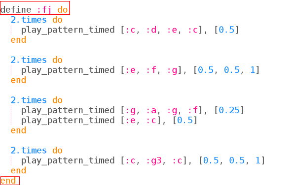
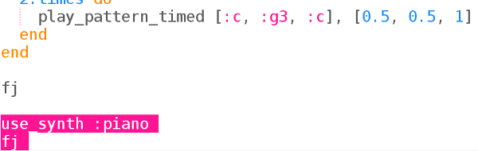

## The tune

في المشروع الأخير ، استخدمت Sonic Pi لبرمجة الموسيقى باستخدام أسماء الحروف. هذه المرة قدمنا لك الموسيقى.

+ اختر مخزن مؤقت في Sonic Pi وتحميليه `frerejacques.txt`. تحقق مع قائد النادي الخاص بك إذا كنت لا تعرف أين يوجد الملف.
    
    
    
    قم بتشغيله. هل تميز هذه النغمة؟
    
    

      <audio controls preload> <source src="resources/frerejacques1.mp3" type="audio/mpeg"> المتصفح الخاص بك لا يدعم عنصر <code>الصوت </code>. </audio>
    

+ دعونا نعطي للحننا اسما حتى نتمكن من تشغيله عندما نريد ذلك.
    
    

+ الآن لن يحدث شيء إذا قمت بتشغيل التعليمة البرمجية الخاص بك. تحتاج إلى إخبار Sonic Pi بتشغيل 'fj'.
    
    أضف السطر التالي لإنهاء الجزء السفلي من التعليمات البرمجية:
    
    

+ جرب عزف النغمة بأداتين مختلفتين:
    
    

تعمل الآلات واحدة تلو الأخرى.