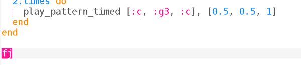

## النبرة (النغمة)

في المشروع الأخير ، استخدمت Sonic Pi لبرمجة الموسيقى باستخدام أسماء الحروف. هذه المرة قدمنا لك الموسيقى.

+ اختر مخزن مؤقت في Sonic Pi وتحميليه `frerejacques.txt`. Check with your Club Leader if you don't know where the file is.
    
    
    
    Run it. Do you recognise the tune?
    
    

      <audio controls preload> <source src="resources/frerejacques1.mp3" type="audio/mpeg"> Your browser does not support the <code>audio</code> element. </audio>
    

+ Let's give our tune a name so that we can play it when we want to.
    
    

+ Now nothing will happen if you run your code. You need to tell Sonic Pi to play 'fj'.
    
    Add the following line to end bottom of your code:
    
    

+ Try playing the tune with two different instruments:
    
    

The instruments play one after the other.