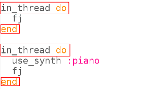

## التزامن

الآن دعونا نحصل على أداتين تعملان معًا لتشغيل اللحن.

+ نحن لا نريد أن تنتظر النسخة الثانية حتى تنتهي النسخة الأولى لذلك سنحتاج إلى إخبار Sonic Pi بأنها لا تحتاج إلى الانتظار. نقوم بذلك عن طريق تشغيل كل نسخة داخل "المقطع البرمجي".
    
    
    
    في الحوسبة نسمي الأشياء التي تحدث في نفس الوقت "التزامن".

+ قم بتشغيل التعليمات البرمجية الخاصة بك ومعرفة ما إذا كان يمكنك سماع الاداتين الموسيقية.
    
    

      <audio controls preload> <source src="resources/frerejacques2.mp3" type="audio/mpeg"> المتصفح الخاص بك لا يدعم هذا الجزء <code>الصوت </code>. </audio>
    

+ ألق نظرة على الإخراج وستشاهد نفس النغمات التي يتم تشغيلها بواسطة كلا الاداتين في نفس الوقت:
    
    
    
    يتم تمييز كل مرة بلون مختلف.

+ دعونا نلقي نظرة على الموسيقى لهذه الجزء الموسيقي.
    
    فيما يلي أول أربعة أشرطة موسيقية:
    
    
    
    والاشرطة الموسيقية الاخيرة:
    
    
    
    قم بتشغيل مشروعك الــ Sonic Pi مرة أخرى وتابعه.

+ (فراري جاك) هي نغمة موسيقية. لقد صممت لكي تبدو جيدة عندما تبدأ إصدارات متعددة منها في أوقات مختلفة. قد تكون شاركت في الغناء أو تشغيل نغمة موسيقية في دروس الموسيقى في المدرسة.
    
    دعنا نضيف فاصل قبل بدء العزف على البيانو:
    
    
    
    كيف يبدو صوته؟
    
    

      <audio controls preload> <source src="resources/frerejacques3.mp3" type="audio/mpeg"> المتصفح الخاص بك لا يدعم عنصر <code>الصوت </code>. </audio>
    

+ انظر إلى الإخراج من Sonic Pi ، هل يمكنك أن ترى متى يبدأ البيانو في اصدار النغمة؟ وعندما تتوقف الآلة الأولى عن اصدار النغمة؟
    
    
    
    This is just an excerpt, look at your Sonic Pi output to see the whole piece.