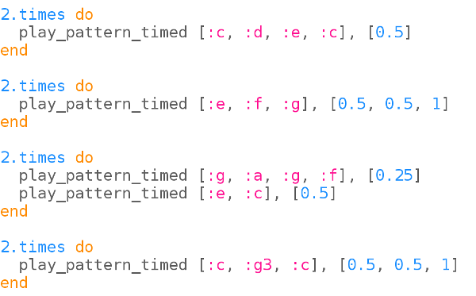
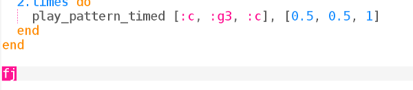

## Die Melodie

Im letzten Projekt haben Sie mit Sonic Pi Musik mit Buchstabennamen programmiert. Dieses Mal haben wir die Musik für Sie bereitgestellt.

+ Wählen Sie einen Puffer in Sonic Pi und laden Sie `frerejacques.txt`. Wenden Sie sich an Ihren Clubleiter, wenn Sie nicht wissen, wo sich die Datei befindet.
    
    
    
    Starte es. Erkennst du die Melodie?
    
    

      <audio controls preload> <source src="resources/frerejacques1.mp3" type="audio/mpeg"> Ihr Browser unterstützt das <code>Audio-</code> Element nicht. </audio>
    

+ Geben wir unserem Stück einen Namen, damit wir es spielen können, wenn wir wollen.
    
    

+ Jetzt passiert nichts, wenn Sie Ihren Code ausführen. Sie müssen Sonic Pi sagen, dass Sie 'fj' spielen sollen.
    
    Fügen Sie die folgende Zeile am Ende Ihres Codes hinzu:
    
    

+ Versuchen Sie, die Melodie mit zwei verschiedenen Instrumenten zu spielen:
    
    

Die Instrumente spielen nacheinander.