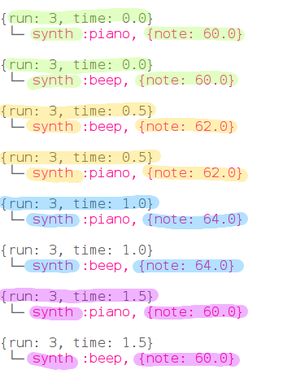

## Parallelität

Jetzt lassen wir zwei Instrumente zusammenarbeiten, um die Melodie zu spielen.

+ Wir möchten nicht, dass die zweite Version wartet, bis die erste abgeschlossen ist. Daher müssen wir Sonic Pi mitteilen, dass sie nicht warten muss. Wir machen dies, indem wir jede Version in einem 'Thread' ausführen.
    
    
    
    In der Informatik bezeichnen wir Dinge, die gleichzeitig passieren, als Parallelität.

+ Führe deinen Code aus und schaue, ob du zwei Instrumente hören kannst.
    
    

    <audio controls preload> 
      <source src="resources/frerejacques2.mp3" type="audio/mpeg"> 
    Ihr Browser unterstützt das <code>Audio-</code> Element nicht. 
    </audio>
    

+ Schau dir die Ausgabe an, und du wirst die gleichen Noten sehen, die von beiden Instrumenten gleichzeitig gespielt werden:
    
    
    
    Jedes Mal wird es in einer anderen Farbe hervorgehoben.

+ Schauen wir uns die Musik für dieses Stück an.
    
    Hier sind die ersten vier Takte:
    
    
    
    Und die letzten vier Takte:
    
    
    
    Führe dein Sonic Pi-Projekt erneut aus und folge ihm.

+ Frere Jacques ist eine Kanon. Es klingt gut, wenn mehrere Versionen zu unterschiedlichen Zeiten starten. Du warst vielleicht am Singen beteiligt oder hast einen Kanon im Musikunterricht in der Schule gespielt.
    
    Lasse uns eine Pause hinzufügen, bevor das Klavier zu spielen beginnt:
    
    
    
    Wie hört es sich an?
    
    

    <audio controls preload> 
      <source src="resources/frerejacques3.mp3" type="audio/mpeg"> 
    Dein Browser unterstützt das <code>Audio-</code> Element nicht. 
    </audio>
    

    
+ Sieh dir die Ausgabe von Sonic Pi an. Kannst du sehen, wann das Klavier zu spielen beginnt? Und wann das erste Instrument aufhört zu spielen?
    
    
    
    Dies ist nur ein Auszug. Schau dir deinen Sonic Pi-Ausgang an, um das ganze Stück zu sehen.