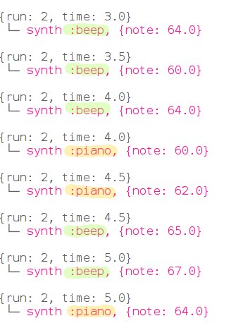

## Parallelität

Lassen Sie uns nun zwei Instrumente zusammenarbeiten, um die Melodie zu spielen.

+ Wir möchten nicht, dass die zweite Version wartet, bis die erste abgeschlossen ist. Daher müssen wir Sonic Pi mitteilen, dass sie nicht warten muss. Wir machen dies, indem wir jede Version in einem 'Thread' ausführen.
    
    
    
    In der Informatik nennen wir Dinge, die gleichzeitig als Parallelität bezeichnet werden.

+ Führen Sie Ihren Code aus und sehen Sie, ob Sie zwei Instrumente hören können.
    
    

      <audio controls preload> <source src="resources/frerejacques2.mp3" type="audio/mpeg"> Ihr Browser unterstützt das <code>Audio-</code> Element nicht. </audio>
    

+ Schauen Sie sich die Ausgabe an, und Sie sehen die gleichen Noten, die von beiden Instrumenten gleichzeitig gespielt werden:
    
    
    
    Jedes Mal wird in einer anderen Farbe hervorgehoben.

+ Schauen wir uns die Musik für dieses Stück an.
    
    Hier sind die ersten vier Bars:
    
    
    
    Und die letzten vier Bars:
    
    
    
    Führen Sie Ihr Sonic Pi-Projekt erneut aus und folgen Sie ihm.

+ Frere Jacques ist eine musikalische Runde. Es klingt gut, wenn mehrere Versionen zu unterschiedlichen Zeiten starten. Sie waren vielleicht am Singen beteiligt oder spielten eine Runde im Musikunterricht in der Schule.
    
    Lassen Sie uns einen Schlaf hinzufügen, bevor das Klavier zu spielen beginnt:
    
    
    
    Wie hört es sich an?
    
    

      <audio controls preload> <source src="resources/frerejacques3.mp3" type="audio/mpeg"> Ihr Browser unterstützt das <code>Audio-</code> Element nicht. </audio>
    

+ Sehen Sie sich die Ausgabe von Sonic Pi an. Können Sie sehen, wann das Klavier zu spielen beginnt? Und wenn das erste Instrument aufhört zu spielen?
    
    
    
    Dies ist nur ein Auszug. Schauen Sie sich Ihren Sonic Pi-Ausgang an, um das ganze Stück zu sehen.