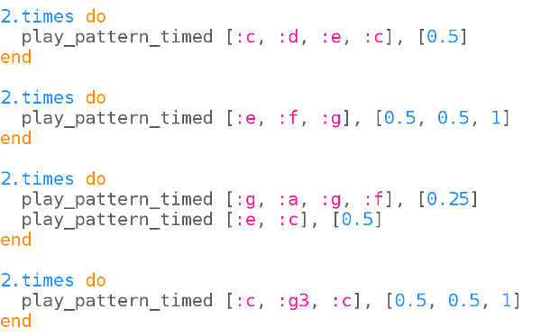

## La melodía

En el último proyecto usaste Sonic Pi para programar música usando nombres de letras. This time we've provided the music for you.

+ Elija un buffer en Sonic Pi y cargue ` frerejacques.txt `. Consulte con su líder de club si tiene algún inconveniente en encontrar el archivo.
    
    
    
    Ejecútelo. ¿Reconoces la melodía?
    
    

      <audio controls preload> <source src="resources/frerejacques1.mp3" type="audio/mpeg"> Tu navegador no tiene soporte para el elemento de <code>audio</code>. </audio>
    

+ Let's give our tune a name so that we can play it when we want to.
    
    

+ Ahora no pasará nada si ejecuta su código. Necesitas decirle a Sonic Pi que reproduzca 'fj'.
    
    Add the following line to end bottom of your code:
    
    

+ Intente tocar la melodía con dos instrumentos diferentes:
    
    

Los instrumentos se tocarán uno después de otro.