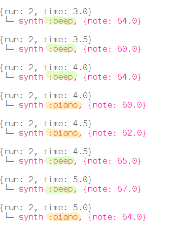

## Programación concurrente

Now let's get two instruments working together to play the tune.

+ No queremos que la segunda versión espere hasta que la primera haya terminado, así que le diremos a Sonic Pi que no necesita esperar. Haremos esto ejecutando cada versión dentro de un 'hilo'.
    
    
    
    In computing we call things happening at the same time 'concurrency'.

+ Ejecute su código y vea si puede escuchar los dos instrumentos.
    
    

      <audio controls preload> <source src="resources/frerejacques2.mp3" type="audio/mpeg"> Tu navegador no tiene soporte para el elemento de <code>audio</code>. </audio>
    

+ Look at the output and you will see the same notes being played by both instruments at the same time:
    
    
    
    Each time is highlighted in a different colour.

+ Let's look at the music for this piece.
    
    Here are the first four bars:
    
    
    
    And the final four bars:
    
    
    
    Run your Sonic Pi project again and follow along.

+ Frere Jacques is a musical round. It's designed to sound good when multiple versions of it start at different times. You might have been involved in singing or playing a round in music lessons at school.
    
    Let's add a sleep before the piano starts playing:
    
    
    
    How does it sound?
    
    

      <audio controls preload> <source src="resources/frerejacques3.mp3" type="audio/mpeg"> Your browser does not support the <code>audio</code> element. </audio>
    

+ Look at the output from Sonic Pi, can you see when the piano starts playing? And when the first instrument stops playing?
    
    
    
    This is just an excerpt, look at your Sonic Pi output to see the whole piece.