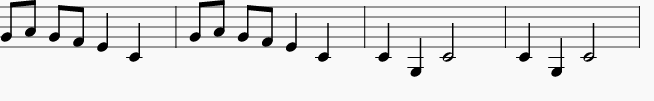
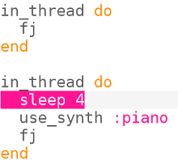

## Programación concurrente

Ahora consigamos que dos instrumentos trabajen juntos para tocar la melodía.

+ No queremos que la segunda versión espere hasta que la primera haya terminado, así que le diremos a Sonic Pi que no necesita esperar. Haremos esto ejecutando cada versión dentro de un 'hilo'.
    
    
    
    En computación llamamos a las cosas que suceden al mismo tiempo "concurrencia".

+ Ejecute su código y vea si puede escuchar los dos instrumentos.
    
    

      <audio controls preload> 
       <source src="resources/frerejacques2.mp3" type="audio/mpeg"> Tu navegador no tiene soporte para el elemento de <code>audio</code>. 
      </audio>
    

+ Mire la salida y verá las mismas notas siendo reproducidas por ambos instrumentos al mismo tiempo:
    
    
    
    Cada tiempo o compás se encuentra resaltado con un color diferente.

+ Centrémonos en la música para esta pieza.
    
    Estos son los primeros cuatro compases:
    
    
    
    Y estos son últimos cuatro compases:
    
    
    
    Ejecute su proyecto Sonic Pi nuevamente y sígalo.

+ Frere Jacques es una ronda musical. Está diseñado para sonar bien cuando varias versiones o sonidos comienzan en diferentes tiempos. Puedes haber estado involucrado en cantar o jugar una ronda de clases de música en la escuela.
    
    Agreguemos un silencio o una pausa antes que el piano comience a tocar:
    
    
    
    ¿Cómo suena ahora?
    
    

      <audio controls preload> 
       <source src="resources/frerejacques3.mp3" type="audio/mpeg"> Tu navegador no tiene soporte para el elemento de <code>audio</code>. 
      </audio>
    

+ Mire el resultado de Sonic Pi, ¿puedes ver cuándo comienza a tocar el piano? ¿Y cuándo deja de tocar el primer instrumento?
    
    
    
    Esto es sólo un extracto, mira tu salida de Sonic Pi para ver toda la pieza.