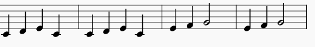

## Programación concurrente

Now let's get two instruments working together to play the tune.

+ No queremos que la segunda versión espere hasta que la primera haya terminado, así que le diremos a Sonic Pi que no necesita esperar. Haremos esto ejecutando cada versión dentro de un 'hilo'.
    
    
    
    In computing we call things happening at the same time 'concurrency'.

+ Ejecute su código y vea si puede escuchar los dos instrumentos.
    
    

      <audio controls preload> <source src="resources/frerejacques2.mp3" type="audio/mpeg"> Tu navegador no tiene soporte para el elemento de <code>audio</code>. </audio>
    

+ Look at the output and you will see the same notes being played by both instruments at the same time:
    
    
    
    Cada tiempo o compás se encuentra resaltado con un color diferente.

+ Let's look at the music for this piece.
    
    Estos son los primeros cuatro compases:
    
    
    
    Y estos son últimos cuatro compases:
    
    
    
    Ejecute su proyecto Sonic Pi nuevamente y sígalo.

+ Frere Jacques es una ronda musical. Está diseñado para sonar bien cuando varias versiones o sonidos comienzan en diferentes tiempos. You might have been involved in singing or playing a round in music lessons at school.
    
    Let's add a sleep before the piano starts playing:
    
    
    
    ¿Cómo suena ahora?
    
    

      <audio controls preload> <source src="resources/frerejacques3.mp3" type="audio/mpeg"> Tu navegador no tiene soporte para el elemento de <code>audio</code>. </audio>
    

+ Mire el resultado de Sonic Pi, ¿puedes ver cuándo comienza a tocar el piano? ¿Y cuándo deja de tocar el primer instrumento?
    
    
    
    This is just an excerpt, look at your Sonic Pi output to see the whole piece.