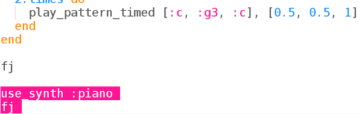

## De melodie

In het laatste project heb je Sonic Pi gebruikt om muziek te programmeren met letternamen. Deze keer hebben we de muziek voor je verzorgd.

+ Kies een buffer in Sonic Pi en laad `frerejacques.txt`. Neem contact op met je clubleider als je niet weet waar het bestand is.
    
    
    
    Voer het uit. Herken je de melodie?
    
    

      <audio controls preload> <source src="resources/frerejacques1.mp3" type="audio/mpeg"> Je browser ondersteunt het element <code>audio</code> niet. </audio>
    

+ Laten we ons nummer een naam geven zodat we het kunnen afspelen wanneer we dat willen.
    
    

+ Nu gebeurt er niets als je je code uitvoert. Je moet Sonic Pi vertellen om 'fj' te spelen.
    
    Voeg de volgende regel toe aan het einde van je code:
    
    

+ Probeer de melodie met twee verschillende instrumenten te spelen:
    
    

De instrumenten spelen één voor één.