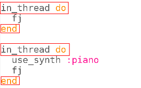
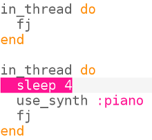

## Gelijktijdigheid

Laten we nu twee instrumenten laten samenwerken om het nummer te spelen.

+ We willen niet dat de tweede versie wacht totdat de eerste is voltooid, dus moeten we Sonic Pi vertellen dat het niet hoeft te wachten. We doen dit door elke versie in een 'thread' uit te voeren.
    
    
    
    In computergebruik noemen we dingen die op hetzelfde moment plaatsvinden 'gelijktijdigheid'.

+ Voer je code uit en kijk of je twee instrumenten kunt horen.
    
    

      <audio controls preload> <source src="resources/frerejacques2.mp3" type="audio/mpeg"> Je browser ondersteunt het element <code>audio</code> niet. </audio>
    

+ Kijk naar de uitvoer en je zult zien dat dezelfde noten tegelijkertijd door beide instrumenten worden gespeeld:
    
    
    
    Ieder tijdstip is met een andere kleur gemarkeerd.

+ Laten we eens kijken naar de muziek voor dit stuk.
    
    Hier zijn de eerste vier maten:
    
    
    
    En de laatste vier maten:
    
    
    
    Voer je Sonic Pi project opnieuw uit en volg het.

+ Vader Jacob is een muzikale canon. Het geluid klinkt goed wanneer meerdere versies ervan op verschillende tijden beginnen. Je hebt het misschien gezongen of gespeeld tijdens muzieklessen op school.
    
    Laten we een sleep (pauze) toevoegen voordat de piano begint te spelen:
    
    
    
    Hoe klinkt het?
    
    

      <audio controls preload> <source src="resources/frerejacques3.mp3" type="audio/mpeg"> Je browser ondersteunt het element <code>audio</code> niet. </audio>
    

+ Kijk naar de uitvoer van Sonic Pi, kun je zien wanneer de piano begint te spelen? En wanneer het eerste instrument stopt met spelen?
    
    
    
    Dit is slechts een uittreksel, kijk naar je Sonic Pi uitvoer om het hele stuk te zien.